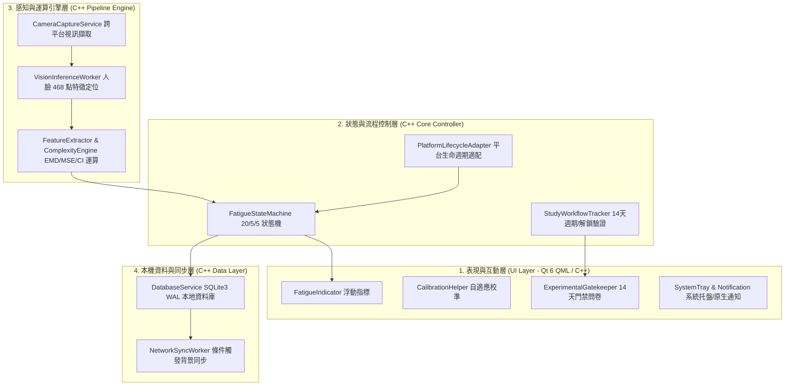

# Eye Fatigue Detection (EFD) 系統架構設計規範 - C++ 跨平台原生架構

## 1. 系統簡介 (System Overview)

本研究旨在開發一款基於 **C++ 單一核心語言** 的跨平台眼睛疲勞偵測與干預應用程式（EFD Native App）。應用程式具備完整的跨平台能力，能在 **Android、iOS、macOS、Windows** 四大主流作業系統上以原生高效能模式運行。

系統採用本機端邊緣運算（純 Client-Side Edge Computing），透過裝置攝影機捕捉影像，融合「常規幾何統計特徵（EAR, PERCLOS）」與「非線性時序複雜度特徵（EMD, MSE）」，動態評估疲勞狀態並給予個人化提醒，同時安全管控為期 14 天的科研實驗數據生命週期。

---

## 2. 核心技術棧 (Tech Stack)

- **核心開發語言:** **Modern C++ (C++20)**（涵蓋 90% 以上業務邏輯、演算法、多執行緒管線、資料庫與平台抽象）
- **跨平台 GUI 框架:** **Qt 6 (C++ / QML)**（支援 Desktop Windows/macOS 與 Mobile Android/iOS 原生渲染）
- **視覺推論引擎:** **ONNX Runtime C++ / MediaPipe C++ Core**
  - _Windows 加速:_ DirectML / CPU (AVX2/AVX-512)
  - _macOS / iOS 加速:_ CoreML / Metal Execution Provider
  - _Android 加速:_ NNAPI / Vulkan Execution Provider
- **非線性訊號處理:** 原生 C++ 演算法庫（結合 **Eigen** 與 SIMD 指令集加速 EMD 與 MSE 運算）
- **本機結構化儲存:** **原生 SQLite3 (C++ API)** + **WAL (Write-Ahead Logging)** 模式（零資料遺失）
- **網路同步傳輸:** **libcurl / Qt Network (C++)**（安全傳輸科研數據與問卷 Token）

---

## 3. 系統分層架構 (Layered Architecture)



### 3.1 表現與互動層 (UI & Presentation Layer)

- **FatigueIndicator (疲勞指示器):** 桌面端提供置頂輕量半透明懸浮視窗 / 行動端提供動態狀態列與卡片，具備「放鬆（綠）」、「注意（黃）」、「警報升級（紅）」三段視覺反饋。
- **CalibrationHelper (動態校準引導):** 首次啟動引導用戶進行眼睛基準線校準，並持續在背景執行**動態滑動窗口基準自適應**，消除光線與鏡頭角度造成的特徵漂移。
- **ExperimentalGatekeeper (實驗門禁):** 第 14 天到期自動鎖定主功能介面，強制進入問卷填答流程。
- **SystemTray & Notification (原生通知適配):**
  - _Windows / macOS:_ 系統托盤圖示常駐、Windows Toast / macOS UserNotification 提示。
  - _Android / iOS:_ 原生本地推播通知 (Local Push Notifications)。

### 3.2 狀態機與流程控制層 (Business Logic & State Layer)

- **FatigueStateMachine (20/5/5 狀態機):** 嚴格調度偵測頻率，管理 20 分鐘冷卻期、5 分鐘輕量快篩與 5 分鐘離座清零邏輯。
- **StudyWorkflowTracker (實驗跟蹤器):** 追蹤 14 天實驗進程、維護實驗加密金鑰、管理問卷上傳與事務型解鎖驗證。
- **PlatformLifecycleAdapter (平台適配層):** 統一處理 Windows/macOS 睡眠喚醒、Android 前台服務 (Foreground Service) 與 iOS 生命週期切換（進入背景暫停、前景熱恢復）。

### 3.3 運算與感知引擎層 (Computation Engine Layer)

- **CameraCaptureService:** 封裝 Qt Multimedia (`QCamera`) / 原生平台 API，提供穩定 30 FPS 的 YUV/RGB 影像串流。
- **VisionInferenceWorker:** 透過 ONNX Runtime C++ 加載 Face Mesh 模型，即時輸出 468 點 3D 臉部特徵座標。
- **ComplexityEngine (C++ 核心):**
  - 幾何特徵：計算雙眼 $\text{EAR}$ (Eye Aspect Ratio)、$\text{PERCLOS}$、眨眼頻率。
  - 非線性特徵：利用 C++ 高效實作 **EMD (經驗模態分解)** 分離瞬態特徵，並透過 **MSE (多尺度熵)** 計算信號複雜度指數（$\text{CI}$）。

### 3.4 本機儲存與同步層 (Data & Persistence Layer)

- **DatabaseService (原生 SQLite3 C++):**
  - 啟用 `PRAGMA journal_mode=WAL;` 與 `PRAGMA synchronous=NORMAL;`，保證資料即時落盤且不阻塞查詢。
  - 保存每分鐘特徵統計、警報歷史、校準參數與問卷記錄。
- **NetworkSyncWorker (C++ 背景同步):** 當裝置滿足「連線 Wi-Fi + 夜間/充電中」條件時，將結構化資料安全上傳至研究中心伺服器。

---

## 4. 原生多執行緒非阻塞管線 (Threading & Pipeline Model)

為杜絕介面掉幀（Jank），系統採用全非同步管線模型，各執行緒職責明確：

```
[Camera Hardware]
       │
       ▼ (Raw Frames)
[Thread 1: Video Capture Thread] ──── (Lock-free Ring Buffer)
       │
       ▼ (Frame Buffer)
[Thread 2: Vision & Inference Worker] ─── (468 Landmarks)
       │
       ▼ (Time-Series Features)
[Thread 3: Signal Processing & State Worker] (EMD / MSE / 20-5-5 FSM)
       │                                  │
       ▼ (State Update Event)             ▼ (Batch Metrics)
[Thread 0: Main UI Thread]        [Thread 4: Database IO Worker]
  (60/120 FPS QML Render)            (SQLite WAL Commit)
```

1.  **Main UI Thread (執行緒 0):** 專注於 Qt Quick 畫面渲染與用戶點擊互動，零重度計算，確保 60/120 FPS 流暢度。
2.  **Video Capture Thread (執行緒 1):** 負責攝影機取幀，透過無鎖環形緩衝區（Lock-free Ring Buffer）傳遞最新影格，自動丟棄過期幀。
3.  **Vision & Inference Thread (執行緒 2):** 呼叫硬體加速（Metal/DirectML/NNAPI）執行神經網路推論。
4.  **Signal & State Worker (執行緒 3):** 累積時序訊號，執行 EMD/MSE 計算，驅動疲勞狀態機轉移。
5.  **Database Worker (執行緒 4):** 佇列化批次寫入 SQLite，完全消除磁碟 I/O 對運算與畫面的影響。

---

## 5. 核心演算法與動態防打擾邏輯

### 5.1 動態滑動窗口基準自適應 (Sliding-window Adaptive Baseline)

針對不同鏡頭角度與環境光線差異，系統採用動態自適應 EAR 閾值：
$$\text{EAR}_{\text{threshold}}(t) = \alpha \cdot \text{EAR}_{\text{baseline}} + (1 - \alpha) \cdot \mu_{\text{window}}(t) - k \cdot \sigma_{\text{window}}(t)$$

- $\text{EAR}_{\text{baseline}}$: 初始校準基礎值。
- $\mu_{\text{window}}, \sigma_{\text{window}}$: 過去 10 分鐘清醒狀態之滑動窗口平均值與標準差。
- $\alpha \in [0.6, 0.8]$: 動態衰減權重，自動抵消光線漸變引起的特徵漂移。

### 5.2 20/5/5 防打擾與算力節能狀態機

- **觸發提醒 (Fatigue Alert):** 當綜合疲勞指數 $\text{CI} > \text{Threshold}$ 且維持超過判定時間，發送一級提醒，並啟動 **20 分鐘冷卻期 (Cooldown)**。
- **降採樣快篩 (5m Fast Screening):**
  - 在 20 分鐘冷卻期內，暫停耗能的 EMD/MSE 全量計算，切換為每 5 分鐘進行一次 30 秒輕量快篩（僅計算 PERCLOS 與眨眼率）。
  - _若疲勞指標持續飆升:_ 升級提醒強度（二級警告/強制休息提示）。
- **離座自動歸零 (5m Auto-Reset):**
  - 若連續 5 分鐘人臉未出現在畫面中，判定用戶已暫離休息。
  - _判定暫離:_ 重置 20 分鐘冷卻計時器，當用戶重新回到鏡頭前時重新啟動基準線評估。

---

## 6. 四大平台特性與常駐支援 (Cross-Platform Implementation)

```
┌──────────────────────────────────────────────────────────────────┐
│                   EFD Core C++20 Shared Library                  │
│       (Algorithms, Vision, State Machine, SQLite, Network)       │
└────────────────┬────────────────┬────────────────┬───────────────┘
                 │                │                │
        ┌────────┴───────┐ ┌──────┴────────┐ ┌─────┴──────────┐
        ▼                ▼ ▼               ▼ ▼                ▼
┌──────────────┐ ┌──────────────┐ ┌────────────────┐ ┌────────────────┐
│   Windows    │ │    macOS     │ │    Android     │ │      iOS       │
│ Qt Desktop   │ │ Qt Desktop   │ │ Qt Android/NDK │ │ Qt iOS/Obj-C++ │
│ WinToast     │ │ NSUserNotif  │ │ Foreground Svc │ │ Local Push     │
│ System Tray  │ │ Status Item  │ │ Camera2 / NDK  │ │ Hot-Resume Mgr │
└──────────────┘ └──────────────┘ └────────────────┘ └────────────────┘
```

| 平台        | 常駐機制 (Background Mode)                                            | 視訊擷取 (Camera Input)                   | 通知方式 (Notification)                           |
| :---------- | :-------------------------------------------------------------------- | :---------------------------------------- | :------------------------------------------------ |
| **Windows** | 最小化至系統托盤 (System Tray)，後台執行緒常駐                        | DirectShow / Media Foundation (Qt/OpenCV) | Windows 10/11 原生 Toast 通知                     |
| **macOS**   | 頂部選單列狀態圖示 (Status Bar Item)，支援後台守護                    | AVFoundation (Qt Multimedia)              | macOS 原生 UNNotification                         |
| **Android** | 註冊 **Foreground Service** + 常駐狀態列通知，搭配 WakeLock 防止休眠  | Android Camera2 API / NDK                 | Android Notification Manager                      |
| **iOS**     | 遵守 iOS 隱私規範，前景即時偵測；進入背景時觸發狀態保存與排程本地通知 | AVFoundation / AVCaptureSession           | iOS Local Push Notification + 熱重啟 (Hot-Resume) |

---

## 7. 14 天實驗流程與事務型安全門禁 (14-Day Study Lifecycle)

1.  **Day 1 ~ Day 13 (正常實驗採樣期):**
    - 系統背景執行 20/5/5 偵測與提醒。
    - SQLite 持續記錄特徵時序資料（匿名 UUID 標記）。
2.  **Day 14 (期滿鎖定):**
    - `StudyWorkflowTracker` 偵測到實驗期滿，觸發 `ExperimentalGatekeeper`。
    - 鎖定所有疲勞偵測 UI，全螢幕呈現後測研究問卷。
3.  **事務型問卷上傳與安全解鎖 (Transactional Unlock):**
    - 用戶提交問卷 $\to$ `NetworkSyncWorker` 將「14天時序指標總結 + 問卷回答」打包上傳伺服器。
    - 伺服器驗證資料完整無缺後，回傳經數位簽章的 **Unlock Token**。
    - App 驗證 Token 成功後，解鎖本機 SQLite，並向受試者顯示「實驗完成代碼」與「軟體解除安裝安全指南」。

---

## 8. 模組代碼架構規劃 (Recommended Code Structure)

```
efd-core/
├── CMakeLists.txt                # 跨平台 CMake 建置腳本 (支援 Desktop / Android NDK / iOS)
├── src/
│   ├── main.cpp                  # 應用程式進入點與 Qt 實例化
│   ├── vision/                   # 視覺與特徵偵測
│   │   ├── CameraService.hpp/cpp # 跨平台相機串流封裝
│   │   └── FaceLandmarker.hpp/cpp# ONNX Runtime 人臉特徵推論
│   ├── analysis/                 # 訊號與數學運算
│   │   ├── FeatureExtractor.hpp  # EAR / PERCLOS / 眨眼特徵
│   │   ├── EmdCalculator.hpp/cpp # C++ 經驗模態分解
│   │   └── MseCalculator.hpp/cpp # 多尺度熵與 CI 複雜度指數
│   ├── state/                    # 狀態機與業務邏輯
│   │   ├── FatigueStateMachine.hpp/cpp # 20/5/5 狀態機
│   │   └── AdaptiveBaseline.hpp  # 滑動窗口動態基準
│   ├── storage/                  # 資料庫與持久化
│   │   └── DatabaseManager.hpp/cpp # SQLite3 WAL 原生封裝
│   ├── study/                    # 科研實驗控管
│   │   └── StudyLifecycle.hpp/cpp# 14 天計時與安全門禁
│   ├── platform/                 # 跨平台原生適配
│   │   ├── windows/              # Windows 托盤與通知
│   │   ├── macos/                # macOS 狀態列與通知
│   │   ├── android/              # Android Foreground Service / JNI
│   │   └── ios/                  # iOS 生命週期管理與 Push
│   └── ui/                       # Qt Quick / QML 介面
│       ├── qml/
│       │   ├── Main.qml
│       │   ├── FatigueIndicator.qml
│       │   ├── CalibrationDialog.qml
│       │   └── QuestionnaireGate.qml
│       └── UIController.hpp/cpp  # QML 與 C++ Core 資料綁定
```

---

## 9. 建議實作路線圖 (Implementation Roadmap)

- **階段一：C++ 原生運算核心與管線 (Core Pipeline MVP)**
  - 搭建 CMake 跨平台建置系統（支援 MSVC/Clang/Android NDK/Xcode）。
  - 整合 ONNX Runtime C++，完成相機取幀到 468 點特徵定位。
  - 實作 EAR、EMD、MSE 演算法，建立獨立單元測試 (Unit Tests)。
- **階段二：狀態機與多執行緒整合 (Multithreaded Engine)**
  - 建立 5 執行緒非同步管線（Ring Buffer）。
  - 實作 `FatigueStateMachine` (20/5/5) 與 `AdaptiveBaseline` 動態自適應。
- **階段三：資料持久化與科研流程 (Data & Study Control)**
  - 實作 SQLite3 WAL 本地資料庫服務，保證零資料遺失。
  - 實作 14 天實驗追蹤與 `ExperimentalGatekeeper` 事務解鎖。
- **階段四：Qt 6 UI 渲染與四大平台原生打磨 (Polishing & Deployment)**
  - 開發 QML 懸浮指標與校準 UI。
  - 完成 Windows 托盤、macOS 狀態列、Android 前台服務及 iOS 生命週期適配。
